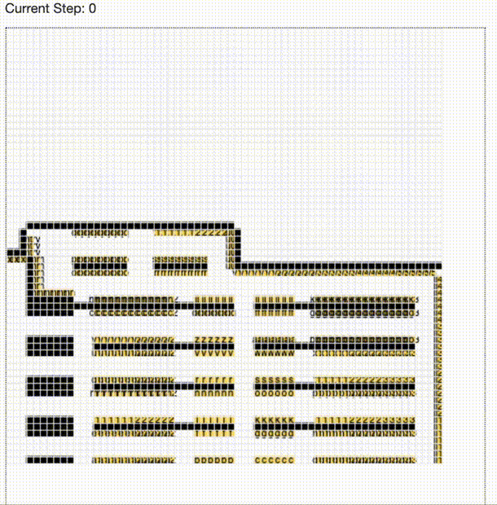

# Grocery Model: Balancing Customer Interactions and Travelling Distance in Supermarket Design
## Assignment for the course Agent Based Modelling at the University of Amsterdam

### Lars Grim - 13511157
### Tjerko Kieft - 11850663
### Jorrim Prins - 11038934
### Florian Tiggeloven - 11872802
### Jacco van Wijk - 11282479

---

    

---

## How To Use

The model can be launched by either running [model.py](mesamodel/model.py) or [__main__.py](mesamodel/__main__.py). [__main__.py](mesamodel/__main.py) runs the Mesa Server. The model configurations can be modified in [config1.json](mesamodel/config1.json) with attributes:

    height : int
        height of the grid
    width : int
        width of the model
    n_persons : int
        amount of persons
    n_items : int
        average amount of items in the objective list
    grid_layout : string
        string of the grid txt file
    avg_arrival : float/int
        average arrival time for the Poisson process
    n_steps : int
        amount of steps at which the store is closed
    speed1 : int
        speed1 of the persons
    speed2 : int
        speed2 of the persons
    speed1_prob : float
        probability of speed1
    speed2_prob : float
        probability of speed2
    familiar1 : float
        familiar1 of the persons
    familiar2 : float
        familiar2 of the persons
    familiar1_prob : float
        probability of familiar1
    familiar2_prob : float
        probability of familiar2
    vision1 : float
        vision1 of the persons
    vision2 : float
        vision2 of the persons
    vision1_prob : float
        probability of vision1
    vision2_prob : float
        probability of vision2
    grid_stepsize : float
        size of one block in the grid
    n_objectives : int
        average amount of items in the objective list

## Requirements:
- [Mesa](https://github.com/projectmesa/mesa) (0.8.9) 
- [NetworkX](https://networkx.org/) (2.5)
- [NumPy](https://numpy.org/) (1.20.1)
- [PyYAML](https://pypi.org/project/PyYAML/) (6.0)
- optional for results and sensitivity analysis:
    - dill (0.3.4)
    - matplotlib (3.3.4)
    - pandas (1.2.4)
    - regex (2021.4.4)
    - SALib (1.4.5)
    - setuptools (52.0.0.post20210125)

## Mesa

The project structure is based on the structure from the Mesa example [Forest Fire](https://github.com/projectmesa/mesa/tree/main/examples/forest_fire). The Model and Agent classes from Mesa are used to base the model and agents on.